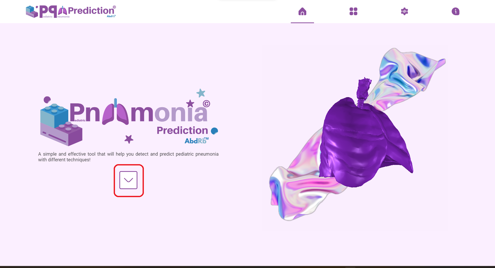

# Deep-Learning-Approach-for-Predicting-Childhood-Pneumonia
Diagnosing pediatric pneumonia consists of three crucial steps : identifying respiratory abnormalities,confirming pneumonia through chest radiographs, and examining the patient’s medical history. In this study, we propose a system that faithfully reflects medical practice by combining image processing, sound processing, and deep learning techniques. We first preprocess the data before submitting it to classification models, using MOBILENET for radiographs and VGG16 for sound recordings. Our system was tested using the Kermany et al dataset for medical images and the SPRSound challenge dataset for sound recordings.
+ Some Python libraries we used:
+ screenshot of our graphical interface using electron :
    
